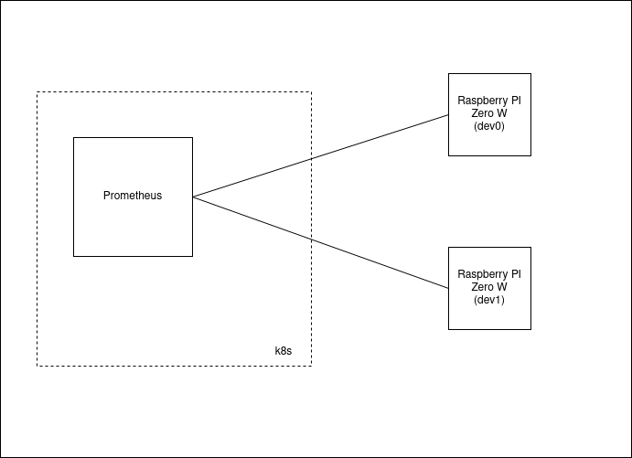
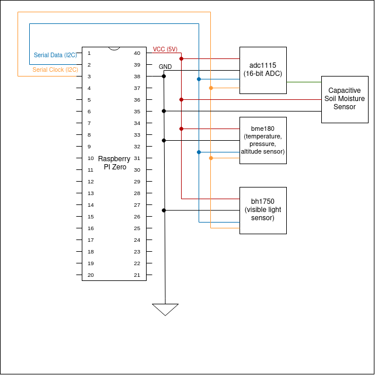
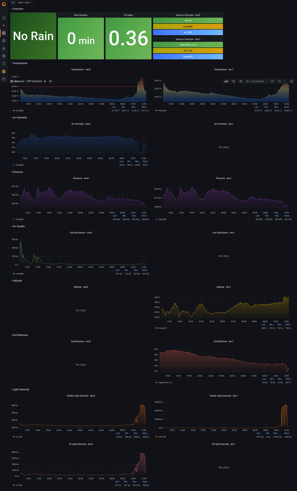

During development, I've used two Raspberry Pi Zero W boards, named dev0 and dev1, connected to my home network and Prometheus stack installed in Kubernetes cluster in the same network.
### Overview

### dev0

[//]: # (Add picture here)

### dev1

[//]: # (Add picture here)

### Prometheus configuration
dev0:
* [endpoint](./config/dev0-endpoints.yaml)
* [service](./config/dev0-service.yaml)
* [serviceMonitor](./config/dev0-serviceMonitor.yaml)

dev1:
* [endpoint](./config/dev1-endpoints.yaml)
* [service](./config/dev1-service.yaml)
* [serviceMonitor](./config/dev1-serviceMonitor.yaml)

### Grafana Dashboard
[Sample Grafana dashboard](./config/grafana_dashboard.json)

